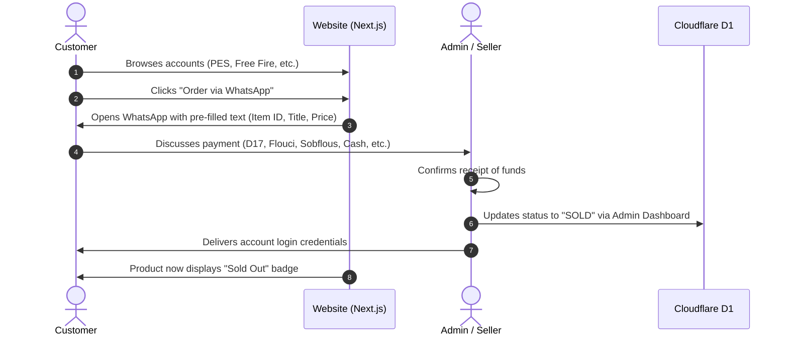

# 🎮 GameStore TN — Gaming Accounts Marketplace

A sleek, fast, Gen-Z styled gaming accounts marketplace (PES/eFootball, Free Fire, etc.) built with **Next.js**, **Framer Motion**, and **Cloudflare D1**.

Designed specifically for the Tunisian/North African market with **Arabic (RTL)** and **French (LTR)** support, featuring a direct-to-WhatsApp/Phone contact purchase model (no automated payment gateways).

## 🌟 Key Features

### 🛒 1. Customer Storefront (Landing Page & Catalog)

- **Gen-Z / Cyberpunk Gaming Aesthetic**: Dark theme, neon accents, glassmorphism, glowing borders.
- **Smooth Animations**: Powered by Framer Motion (scroll triggers, hover tilt effects, staggered card reveals).
- **Bilingual Support (i18n)**:
  - 🇹🇳 Arabic / Tunisian Derja (RTL — Right-to-Left layout)
  - 🇫🇷 French (LTR — Left-to-Right layout)
- **Smart Filters & Search**: Filter by game (Free Fire, PES/eFootball, Steam, etc.), price range, and availability.
- **Direct "Buy via WhatsApp/Call" Flow**:
  - Clicking an account opens a pre-filled WhatsApp message with the item's ID, title, and price.
  - Direct phone contact option for instant negotiation.
- **Real-Time Availability Badge**: Clearly shows `In Stock` vs `Sold / Out of Stock`.

### 🛠️ 2. Admin Dashboard

- **Protected Authentication**: Secure admin login.
- **Full CRUD Management**:
  - **Add Account**: Title, Game category, Price (TND / EUR), Description/Specs, Image URLs, Status.
  - **Edit Account**: Update prices, update credentials/details, upload new screenshots.
  - **Delete Account**: Remove old listings.
  - **1-Click Mark as Sold**: Mark an item as `Sold` once payment is confirmed via WhatsApp/Cash.

## 🏗️ Tech Stack

| Layer          | Technology                                                                     | Purpose                                    |
| :------------- | :----------------------------------------------------------------------------- | :----------------------------------------- |
| **Framework**  | [Next.js](https://nextjs.org/) (App Router, React 19)                          | Frontend & Edge API routes                 |
| **Styling**    | [Tailwind CSS](https://tailwindcss.com/) + [shadcn/ui](https://ui.shadcn.com/) | Modern UI & dark/neon gaming theme         |
| **Animations** | [Framer Motion](https://www.framer.com/motion/)                                | Smooth page transitions, scroll animations |
| **Database**   | [Cloudflare D1](https://developers.cloudflare.com/d1/)                         | Serverless SQL database at the edge        |
| **Deployment** | [Cloudflare Workers](https://workers.cloudflare.com/) via [@opennextjs/cloudflare](https://opennext.js.org/cloudflare) | Global Edge hosting with ultra-low latency |
| **i18n / RTL** | `next-intl`                                                                    | Arabic (RTL) & French localization         |
| **Icons**      | [Lucide React](https://lucide.dev/)                                            | Gaming and UI icons                        |

## 🔄 Purchase & Order Flow



## 🗄️ Database Schema (`schema.sql` for Cloudflare D1)

```sql
-- Categories table (e.g., Free Fire, eFootball PES, PUBG, Valorant)
CREATE TABLE IF NOT EXISTS categories (
    id TEXT PRIMARY KEY,
    name_ar TEXT NOT NULL,
    name_fr TEXT NOT NULL,
    slug TEXT UNIQUE NOT NULL,
    icon_url TEXT
);

-- Accounts / Products table
CREATE TABLE IF NOT EXISTS products (
    id TEXT PRIMARY KEY,
    title_ar TEXT NOT NULL,
    title_fr TEXT NOT NULL,
    category_id TEXT NOT NULL,
    price REAL NOT NULL,
    currency TEXT DEFAULT 'TND',
    description_ar TEXT,
    description_fr TEXT,
    images TEXT NOT NULL, -- JSON string array: '["url1", "url2"]'
    status TEXT CHECK(status IN ('AVAILABLE', 'RESERVED', 'SOLD')) DEFAULT 'AVAILABLE',
    featured INTEGER DEFAULT 0, -- 1 for true, 0 for false
    created_at DATETIME DEFAULT CURRENT_TIMESTAMP,
    FOREIGN KEY (category_id) REFERENCES categories(id) ON DELETE CASCADE
);

-- Admin Users table
CREATE TABLE IF NOT EXISTS admins (
    id TEXT PRIMARY KEY,
    username TEXT UNIQUE NOT NULL,
    password_hash TEXT NOT NULL,
    created_at DATETIME DEFAULT CURRENT_TIMESTAMP
);
```

## 📁 Project Structure

```text
├── app/
│   ├── [locale]/                   # Localized routes (ar/fr)
│   │   ├── (storefront)/
│   │   │   ├── page.tsx            # Gen-Z Landing & Showcase Page
│   │   │   ├── product/[id]/       # Account Detail View
│   │   │   └── layout.tsx          # RTL/LTR setup & Header/Footer
│   │   ├── admin/
│   │   │   ├── login/              # Admin Login
│   │   │   ├── dashboard/          # Inventory management (CRUD)
│   │   │   └── layout.tsx
│   │   └── layout.tsx
│   └── api/                        # Edge API routes interacting with D1
│       ├── products/
│       │   └── route.ts            # GET, POST, PUT, DELETE products
│       └── auth/
│           └── route.ts            # Admin authentication
├── components/
│   ├── animations/                 # Framer Motion components (FadeIn, ScrollReveal)
│   ├── storefront/                 # ProductCard, HeroSection, FilterBar
│   ├── admin/                      # ProductForm, DataTable, StatusToggle
│   └── ui/                         # Buttons, Modals, Badges (shadcn/ui)
├── messages/                       # Translation JSON files
│   ├── ar.json                     # Arabic / Tunisian
│   └── fr.json                     # French
├── public/                         # Static assets & game logos
├── wrangler.toml                   # Cloudflare configuration
└── schema.sql                      # Database migration file
```

## 🚀 Getting Started

### 1. Prerequisites

- **Node.js 22** and npm 10+ (matches the CI pipeline)
- A Cloudflare account (only needed for deployment)

Wrangler runs via `npx` from the project's dev dependencies — no global install required.

### 2. Installation

Clone the repository and install dependencies:

```bash
git clone https://github.com/AmineMabrouk17/GameStore-TN.git
cd GameStore-TN
npm ci
```

### 3. Environment Files

Two gitignored env files drive local development. Copy both examples and fill in a real secret:

```bash
cp .env.example .env.local
cp .dev.vars.example .dev.vars
openssl rand -base64 48   # paste the output as ADMIN_JWT_SECRET in both files
```

| File            | Read by                          | Why it exists                                                                 |
| :-------------- | :------------------------------- | :---------------------------------------------------------------------------- |
| `.env.local`    | `next dev` / `next build`        | Feeds `process.env` — **required for API routes to sign session JWTs locally** |
| `.dev.vars`     | `wrangler dev` (`cf:preview`)    | Injects secrets into the Workers runtime when previewing the built worker      |

> `NEXT_PUBLIC_*` variables are inlined at build/dev start — restart the dev server after changing them.

### 4. Local D1 Database

Create the schema and seed demo data in your local D1 (Miniflare state under `.wrangler/`):

```bash
npm run db:schema:local
npm run db:seed:local
```

The seed creates an admin user whose password hash is a placeholder. Set your own before logging in:

```bash
npm run hash:password -- 'YourStrongPassword'
# then update the row with the printed hash:
npx wrangler d1 execute gamestore_db --local \
  --command "UPDATE admins SET password_hash = '<printed-hash>' WHERE username = 'admin'"
```

### 5. Run the Development Server

```bash
npm run dev
```

Open [http://localhost:3000/fr](http://localhost:3000/fr) (French) or `/ar` (Arabic, RTL). `next.config.ts` calls `initOpenNextCloudflareForDev()`, so `next dev` talks to the same local D1 bindings as production.

## 📜 Scripts

| Script                  | Purpose                                                        |
| :---------------------- | :-------------------------------------------------------------- |
| `dev`                   | Next.js dev server with local Cloudflare bindings               |
| `build`                 | Standard Next.js production build                               |
| `start`                 | Serve the standard Node.js build                                |
| `typecheck`             | `tsc --noEmit`                                                  |
| `lint`                  | ESLint                                                          |
| `test` / `test:watch`   | Vitest unit suites (run once / watch)                           |
| `test:e2e`              | Playwright e2e suite (see `tests/e2e/README.md`)                |
| `hash:password`         | Print a PBKDF2 hash for an admin password: `npm run hash:password -- '<pw>'` |
| `db:schema:local`       | Apply `schema.sql` to the local D1 database                     |
| `db:seed:local`         | Apply `seed.sql` to the local D1 database                       |
| `cf:build`              | Build the OpenNext worker bundle into `.open-next/`             |
| `cf:preview`            | Run the built worker locally via wrangler (uses `.dev.vars`)    |
| `cf:deploy`             | Build + deploy the worker to Cloudflare                         |

## 🚢 Deployment (Cloudflare Workers)

### One-time setup

1. **Log in to Cloudflare:**

   ```bash
   npx wrangler login
   ```

2. **Create the remote D1 database:**

   ```bash
   npx wrangler d1 create gamestore_db
   ```

3. **Wire up `wrangler.toml`:** replace `REPLACE_WITH_YOUR_D1_DATABASE_ID` with the `database_id` from the previous step.

4. **Apply the remote schema** (repeat after future schema changes):

   ```bash
   npx wrangler d1 execute gamestore_db --remote --file=./schema.sql
   ```

5. **(Optional) Seed remote demo data**, then immediately rotate the admin password:

   ```bash
   npx wrangler d1 execute gamestore_db --remote --file=./seed.sql
   npm run hash:password -- 'YourProductionPassword'
   npx wrangler d1 execute gamestore_db --remote \
     --command "UPDATE admins SET password_hash = '<printed-hash>' WHERE username = 'admin'"
   ```

### Deploy

6. **Set the JWT secret** (prompts for a value; use the same `openssl rand -base64 48` recipe):

   ```bash
   npx wrangler secret put ADMIN_JWT_SECRET
   ```

7. **Build & deploy:** `NEXT_PUBLIC_*` values are inlined at build time, so export them in the shell (or CI environment) first:

   ```bash
   export NEXT_PUBLIC_SELLER_PHONE="+216XXXXXXXX"
   export NEXT_PUBLIC_WHATSAPP_NUMBER="216XXXXXXXX"
   # optional, for absolute OG/canonical URLs:
   export NEXT_PUBLIC_SITE_URL="https://your-domain.tn"
   npm run cf:deploy
   ```

8. **Smoke-check the deployment:** storefront renders products → admin login works → create/edit/delete round-trip → WhatsApp button opens a pre-filled message.

### CI/CD (automatic deploys)

Every push to `main` runs the gate job (typecheck, lint, unit tests, build) and
then deploys to Cloudflare production automatically. Required repository settings:

| Setting | Where | Value |
| :-- | :-- | :-- |
| `CLOUDFLARE_API_TOKEN` | Actions secret | Token with **Workers Scripts: Edit** + **D1: Edit** permissions |
| `CLOUDFLARE_ACCOUNT_ID` | Actions secret | Your Cloudflare account ID |
| `NEXT_PUBLIC_SELLER_PHONE` | Actions variable | e.g. `+21692390892` |
| `NEXT_PUBLIC_WHATSAPP_NUMBER` | Actions variable | e.g. `21692390892` |
| `NEXT_PUBLIC_SITE_URL` | Actions variable (optional) | Canonical origin for SEO URLs |

The workflow applies the idempotent `schema.sql` to the remote D1 database
before each deploy; `ADMIN_JWT_SECRET` stays a runtime Worker secret and is
never needed at build time.

## 🔐 Secrets Checklist

| Variable                      | Kind              | Used by                                  | Local source                | Production                              |
| :---------------------------- | :---------------- | :--------------------------------------- | :-------------------------- | :-------------------------------------- |
| `ADMIN_JWT_SECRET`            | Secret            | `lib/auth/session.ts` (HS256 sessions)   | `.env.local` + `.dev.vars`  | `npx wrangler secret put ADMIN_JWT_SECRET` |
| `NEXT_PUBLIC_SELLER_PHONE`    | Public build-time | `lib/whatsapp.ts` (tel: links)           | `.env.local`                | Shell/CI env at `cf:build` time         |
| `NEXT_PUBLIC_WHATSAPP_NUMBER` | Public build-time | `lib/whatsapp.ts` (wa.me links)          | `.env.local`                | Shell/CI env at `cf:build` time         |
| `NEXT_PUBLIC_SITE_URL`        | Public build-time | SEO `metadataBase` (canonical/OG URLs)   | `.env.local` (optional)     | Shell/CI env at `cf:build` time (optional) |

## 🧪 Quality Gates

Run the full gate locally before opening a PR (CI runs the same pipeline on every PR):

```bash
npm run typecheck && npm run lint && npm test && npm run build
```

## 🌐 WhatsApp Integration Details

The direct purchase button formats a URL like this:

```ts
const message = encodeURIComponent(
  `Bonjour, je suis intéressé par le compte : ${product.title} (ID: ${product.id}) au prix de ${product.price} TND.`
);
const whatsappUrl = `https://wa.me/${process.env.NEXT_PUBLIC_WHATSAPP_NUMBER}?text=${message}`;
```
