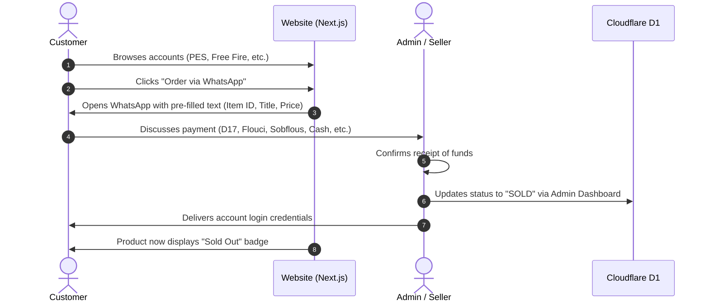

# 🎮 GameStore TN — Gaming Accounts Marketplace

A sleek, fast, Gen-Z styled gaming accounts marketplace (PES/eFootball, Free Fire, etc.) built with **Next.js**, **Framer Motion**, and **Cloudflare D1**.

Designed specifically for the Tunisian/North African market with **Arabic (RTL)** and **French (LTR)** support, featuring a direct-to-WhatsApp/Phone contact purchase model (no automated payment gateways).

## 🌟 Key Features

### 🛒 1. Customer Storefront (Landing Page & Catalog)

- **Gen-Z / Cyberpunk Gaming Aesthetic**: Dark theme, neon accents, glassmorphism, glowing borders.
- **Smooth Animations**: Powered by Framer Motion (scroll triggers, hover tilt effects, staggered card reveals).
- **Bilingual Support (i18n)**:
  - 🇹🇳 Arabic / Tunisian Derja (RTL — Right-to-Left layout)
  - 🇫🇷 French (LTR — Left-to-Right layout)
- **Smart Filters & Search**: Filter by game (Free Fire, PES/eFootball, Steam, etc.), price range, and availability.
- **Direct "Buy via WhatsApp/Call" Flow**:
  - Clicking an account opens a pre-filled WhatsApp message with the item's ID, title, and price.
  - Direct phone contact option for instant negotiation.
- **Real-Time Availability Badge**: Clearly shows `In Stock` vs `Sold / Out of Stock`.

### 🛠️ 2. Admin Dashboard

- **Protected Authentication**: Secure admin login.
- **Full CRUD Management**:
  - **Add Account**: Title, Game category, Price (TND / EUR), Description/Specs, Image URLs, Status.
  - **Edit Account**: Update prices, update credentials/details, upload new screenshots.
  - **Delete Account**: Remove old listings.
  - **1-Click Mark as Sold**: Mark an item as `Sold` once payment is confirmed via WhatsApp/Cash.

## 🏗️ Tech Stack

| Layer          | Technology                                                                     | Purpose                                    |
| :------------- | :----------------------------------------------------------------------------- | :----------------------------------------- |
| **Framework**  | [Next.js](https://nextjs.org/) (App Router, React 19)                          | Frontend & Edge API routes                 |
| **Styling**    | [Tailwind CSS](https://tailwindcss.com/) + [shadcn/ui](https://ui.shadcn.com/) | Modern UI & dark/neon gaming theme         |
| **Animations** | [Framer Motion](https://www.framer.com/motion/)                                | Smooth page transitions, scroll animations |
| **Database**   | [Cloudflare D1](https://developers.cloudflare.com/d1/)                         | Serverless SQL database at the edge        |
| **Deployment** | [Cloudflare Pages](https://pages.cloudflare.com/) / Workers                    | Global Edge hosting with ultra-low latency |
| **i18n / RTL** | `next-intl`                                                                    | Arabic (RTL) & French localization         |
| **Icons**      | [Lucide React](https://lucide.dev/)                                            | Gaming and UI icons                        |

## 🔄 Purchase & Order Flow



## 🗄️ Database Schema (`schema.sql` for Cloudflare D1)

```sql
-- Categories table (e.g., Free Fire, eFootball PES, PUBG, Valorant)
CREATE TABLE IF NOT EXISTS categories (
    id TEXT PRIMARY KEY,
    name_ar TEXT NOT NULL,
    name_fr TEXT NOT NULL,
    slug TEXT UNIQUE NOT NULL,
    icon_url TEXT
);

-- Accounts / Products table
CREATE TABLE IF NOT EXISTS products (
    id TEXT PRIMARY KEY,
    title_ar TEXT NOT NULL,
    title_fr TEXT NOT NULL,
    category_id TEXT NOT NULL,
    price REAL NOT NULL,
    currency TEXT DEFAULT 'TND',
    description_ar TEXT,
    description_fr TEXT,
    images TEXT NOT NULL, -- JSON string array: '["url1", "url2"]'
    status TEXT CHECK(status IN ('AVAILABLE', 'RESERVED', 'SOLD')) DEFAULT 'AVAILABLE',
    featured INTEGER DEFAULT 0, -- 1 for true, 0 for false
    created_at DATETIME DEFAULT CURRENT_TIMESTAMP,
    FOREIGN KEY (category_id) REFERENCES categories(id) ON DELETE CASCADE
);

-- Admin Users table
CREATE TABLE IF NOT EXISTS admins (
    id TEXT PRIMARY KEY,
    username TEXT UNIQUE NOT NULL,
    password_hash TEXT NOT NULL,
    created_at DATETIME DEFAULT CURRENT_TIMESTAMP
);
```

## 📁 Project Structure

```text
├── app/
│   ├── [locale]/                   # Localized routes (ar/fr)
│   │   ├── (storefront)/
│   │   │   ├── page.tsx            # Gen-Z Landing & Showcase Page
│   │   │   ├── product/[id]/       # Account Detail View
│   │   │   └── layout.tsx          # RTL/LTR setup & Header/Footer
│   │   ├── admin/
│   │   │   ├── login/              # Admin Login
│   │   │   ├── dashboard/          # Inventory management (CRUD)
│   │   │   └── layout.tsx
│   │   └── layout.tsx
│   └── api/                        # Edge API routes interacting with D1
│       ├── products/
│       │   └── route.ts            # GET, POST, PUT, DELETE products
│       └── auth/
│           └── route.ts            # Admin authentication
├── components/
│   ├── animations/                 # Framer Motion components (FadeIn, ScrollReveal)
│   ├── storefront/                 # ProductCard, HeroSection, FilterBar
│   ├── admin/                      # ProductForm, DataTable, StatusToggle
│   └── ui/                         # Buttons, Modals, Badges (shadcn/ui)
├── messages/                       # Translation JSON files
│   ├── ar.json                     # Arabic / Tunisian
│   └── fr.json                     # French
├── public/                         # Static assets & game logos
├── wrangler.toml                   # Cloudflare configuration
└── schema.sql                      # Database migration file
```

## 🚀 Getting Started

### 1. Prerequisites

- Node.js (v18 or later)
- Cloudflare Wrangler CLI:

```bash
npm install -g wrangler
```

### 2. Installation

Clone the repository and install dependencies:

```bash
git clone https://github.com/AmineMabrouk17/GameStore-TN.git
cd gamestore-tn
npm install
```

### 3. Setup Cloudflare D1 Database

Log in to Cloudflare and create a local & remote D1 database:

```bash
# Login to Cloudflare
npx wrangler login

# Create D1 Database
npx wrangler d1 create gamestore_db
```

Update your `wrangler.toml` with the generated database ID:

```toml
name = "gamestore-tn"
compatibility_date = "2024-01-01"

[[d1_databases]]
binding = "DB"
database_name = "gamestore_db"
database_id = "YOUR_DATABASE_ID_HERE"
```

Apply the database schema locally:

```bash
npx wrangler d1 execute gamestore_db --local --file=./schema.sql
```

### 4. Environment Variables

Create a `.env.local` file in the root directory:

```env
NEXT_PUBLIC_SELLER_PHONE="+216XXXXXXXX"
NEXT_PUBLIC_WHATSAPP_NUMBER="216XXXXXXXX"
ADMIN_JWT_SECRET="your-ultra-secure-jwt-secret"
```

### 5. Run the Development Server

```bash
npm run dev
```

Open [http://localhost:3000](http://localhost:3000) to view the storefront.

## 🌐 WhatsApp Integration Details

The direct purchase button formats a URL like this:

```ts
const message = encodeURIComponent(
  `Bonjour, je suis intéressé par le compte : ${product.title} (ID: ${product.id}) au prix de ${product.price} TND.`
);
const whatsappUrl = `https://wa.me/${process.env.NEXT_PUBLIC_WHATSAPP_NUMBER}?text=${message}`;
```

## 🚢 Deployment to Cloudflare Pages

1. **Deploy D1 Migrations to Production:**

   ```bash
   npx wrangler d1 execute gamestore_db --remote --file=./schema.sql
   ```

2. **Deploy the Next.js App:**

   ```bash
   npm run build
   npx wrangler pages deploy .vercel/output/static
   ```

   (Or connect your GitHub repository directly to Cloudflare Pages via the dashboard).
